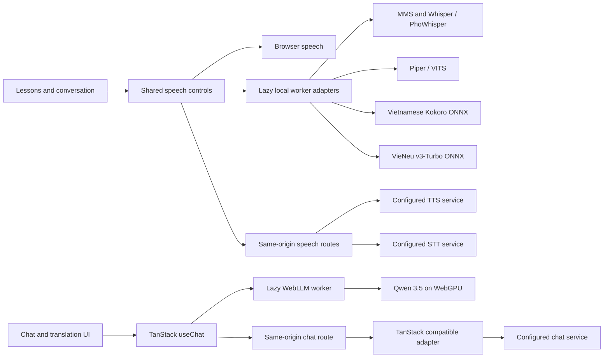

# AI architecture

Learning pages need three capabilities: pronounce text, transcribe an attempt, and stream a conversation. Their interfaces do not depend on a model runtime.

## Effect 4 boundaries

Effect Schema is the source of truth for speech languages, backend selections, synthesis input, transcripts, capabilities, chat roles/content, translation direction, relationship, and gender. The same schemas derive TypeScript types. Server endpoint configuration is decoded independently for each capability. Missing or malformed services are unavailable; a broken TTS configuration does not disable chat or English speech.

Speech operations use typed `AppError` failures for validation, configuration, provider rejection, connection, and microphone permission. Responses expose a small JSON error contract and never forward raw upstream diagnostics. Browser failures are separate from an empty transcript. Effect timeouts cover request headers and body reads; scoped resources abort upstream fetches and cancel readers on completion, failure, or interruption.

Browser media operations use scopes to stop microphone tracks and recorders, close Web Audio contexts, clear silence/recording timers, remove event handlers, and stop/disconnect playback sources. Late microphone permission after cancellation immediately releases the stream. Changing a control's text, voice, language, or backend remounts its active operation and cancels the old one. Pure lesson generation and rendering remain ordinary functions; wrapping them in Effect would add no resource or failure guarantees.

All local synthesizers emit 16-bit PCM WAV. Local and server playback unlock sound in the original click, before downloading models or synthesizing, then decode a buffer and use a scoped Web Audio source. This avoids HTML media fetch/reset promises and delayed autoplay activation. Cancellation stops/disconnects the source and closes its context, including decoding failures. Invalid server audio is evicted from the response cache so retry can recover. The root document disables automatic translation on both html and body (Firefox checks the body) to preserve Vietnamese lesson text during hydration; formatted lesson numbers use an explicit locale.

Local models are described by a lightweight catalogue. Only worker entry points import their inference runtimes. Selection starts the corresponding runtime worker; first use downloads model weights. Each language/capability has at most one resident worker, replaced on model changes. Worker messages use Effect Schema; unknown models and unsupported languages are rejected. Stop/interruption terminates the worker because ONNX inference does not provide a reliable per-call cancellation API. Local operations allow ten minutes for downloads/inference, and failed workers are discarded. Successful models remain warm. Kokoro and VieNeu share a lazy sea-g2p WASM phonemizer; neither requires a speech server or Python in the browser. VieNeu uses preset conditioning and the MOSS codec. ONNX sessions with external weights are created sequentially to avoid ORT mounting races. Native voices and local models share one selector per language/capability. Recognition decodes microphone audio and resamples to mono 16 kHz locally; no recording upload occurs.

## HTTP contracts

| App route                                 | Contract                                                                                                                                                   |
| ----------------------------------------- | ---------------------------------------------------------------------------------------------------------------------------------------------------------- |
| `GET /api/speech/capabilities`            | `{tts: {vn: boolean, en: boolean}, stt: boolean, chat: boolean}`; configuration availability only                                                          |
| `POST /api/speech/synthesize`             | JSON `{text, language}` with language `vn` or `en`; nonempty trimmed text, at most 4096 characters; returns audio                                          |
| `POST /api/speech/transcribe?language=vn` | Raw encoded audio and its `Content-Type`; returns `{text: string}`                                                                                         |
| `POST /api/chat`                          | TanStack's AG-UI envelope, parsed by `chatParamsFromRequestBody`; allowlisted `forwardedProps` select practice or translation; returns TanStack SSE events |
| `GET /api/chat/models`                    | `{models: string[], defaultModel: string or null, thinking: boolean}`; server allowlist only, no credentials or upstream URLs                              |

Speech requests and generated audio are limited to 10 MiB. JSON bodies and transcript responses are limited to 128 KiB. Recordings stop after 60 seconds or after detected speech followed by 1.5 seconds of silence; manual stop is always available. Speech server work and chat streaming are capped at 90 seconds. The speech client allows 95 seconds to receive the server's timeout response. Chat history is capped at 100 messages and 8192 characters per message; exceeding a limit returns a validation error and Reset starts a fresh session.

The app asks server providers for WAV speech. Server transcription preserves the recorded format and supplies its extension in multipart uploads. Local transcription decodes/resamples to PCM in the browser. Recognition normalizes Vietnamese digit-only results using the existing lesson utility. Playback retains click-to-play/stop and hold-for-slower-audio controls. Native browser synthesis rate changes during an utterance are browser-dependent; local/server audio uses Web Audio playback rate.

## TanStack responsibilities

`useChat` owns messages, streaming, loading/error state, stopping, and resetting. A feature-owned connection delegates server mode to `fetchServerSentEvents`; local mode maps validated worker deltas to AG-UI events. The server uses TanStack's parser and `toServerSentEventsResponse`. Reasoning mirror entries are excluded from the next request. Local Qwen think tags are parsed across token boundaries into separate reasoning events, never speech text. Translation controls reset on relationship/gender changes; model changes stop and clear the current conversation.

Only the two conversation routes import the AI settings and conversation hook. Their left drawer owns English speech and conversation choices; the shared right drawer owns Vietnamese speech. Chat preferences persist independently from speech preferences. A configured server default takes precedence for new sessions, otherwise Qwen 3.5 2B is selected. Browser capability detection never imports WebLLM or downloads weights. The inference library lives only in a worker created on the first local message, avoiding a duplicate runtime in the UI and SSR bundles. Warm workers survive messages, but Stop/errors/model changes/module exit terminate them. Leaving these routes also releases English speech workers. WebLLM caches weights separately from conversation state.

Local practice history is limited to nine recent messages and 3500 characters while displayed history remains intact. The compiled model uses a 4096-token context; the runtime reports an explicit error if tokenization exceeds it. Local loading/inference times out after ten minutes. Translation uses only the current utterance and no thinking. Server model selection is checked against `AI_CHAT_MODEL` plus `AI_CHAT_MODELS`; generation settings remain server-owned.

## Deployment and verification

Deploy the app with its server runtime. Set server-only `AI_*` environment variables and restart after changing configuration. A static frontend-only host cannot serve these routes. The app has no authentication; a public deployment should enforce your chosen access and quota controls at the hosting boundary before exposing paid services.

Local speech needs no configured AI service. Browser-local chat additionally requires WebGPU on HTTPS or localhost. Native browser/server selections load no inference workers. Model and phonemizer assets need public hosts on cold load; weights remain in browser storage after workers terminate. Speech workers use single-thread-compatible WASM without requiring cross-origin isolation.

Tests exercise speech configuration, malformed/oversized requests, language/voice routing, multipart recordings, typed failures, timeout cancellation, browser resource cleanup, and TanStack client-to-provider streaming. After building, `vp run test:ai` starts local mock services and checks the compiled app in Chromium, including actual MediaRecorder upload, playback, streaming, Stop/Reset, settings, and lesson routes. Mocked providers verify transport and contracts, not pronunciation accuracy; evaluate the selected service's voices and recognition separately.

`vp run test:ai:firefox` runs the same checks in Firefox. `vp run test:audio-model` additionally downloads MMS weights and checks actual playback of `năm` and repeated `mười hai` in Firefox, plus malformed-audio failure handling. `vp run test:audio-dev` runs those checks against the development server. Worker dependencies are pre-bundled to avoid a first-inference dependency-discovery reload. `vp run test:chat-models` exercises real Qwen 3.5 0.8B inference in Chromium, Vietnamese/English replies and successive messages without server chat requests; it needs WebGPU and substantial memory.

Unit tests also verify local worker reuse, selection/cancellation cleanup, malformed responses, no server calls, and migration of original model selections. `vp run test:speech-models` is an opt-in network check that downloads public weights and performs real Chromium inference for MMS VN/EN, the three Vietnamese Piper voices, an English Piper voice, PhoWhisper Tiny and Whisper Tiny. It is a runtime compatibility check, not a recognition or pronunciation benchmark across all model sizes/devices.

`vp run test:speech-additional` validates all 14 Kokoro/25 VieNeu preset assets, runs actual Kokoro/VieNeu synthesis in Chromium, and transcribes generated samples with local recognition. The tokenizer has golden compatibility tests against the upstream tokenizer. The generated phonemizer has its upstream license and modification notice in `public/speech/`.
